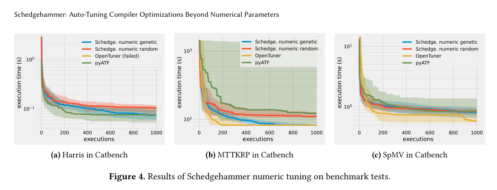
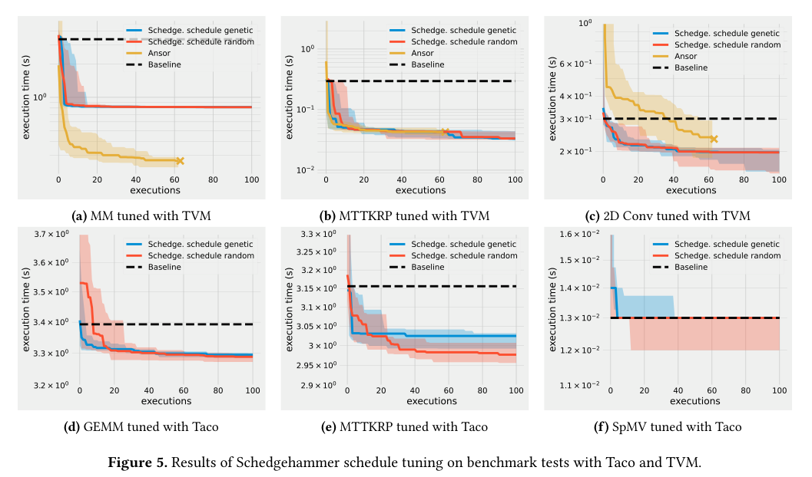
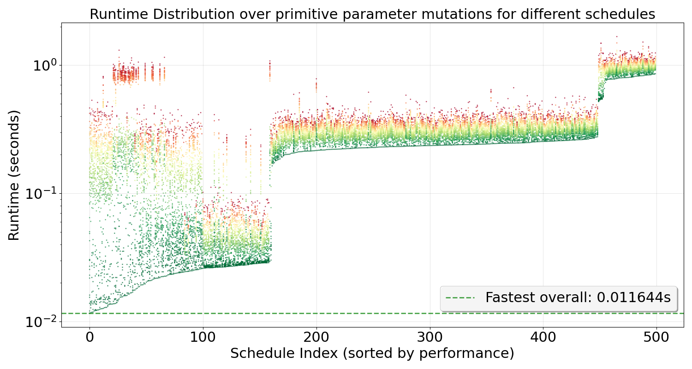

# Schedgehammer: Auto-Tuning Compiler Optimizations Beyond Numerical Parameters

## Goal of the Research Project

Schedgehammer is a general-purpose auto-scheduling framework designed to optimize program schedules across diverse compiler infrastructures. Unlike existing auto-schedulers that are tightly coupled to specific intermediate representations or rely on template-based search, Schedgehammer introduces a **generic and reusable representation of optimization schedules** that can be integrated with multiple user-schedulable languages (USLs).

The key research goal is to **decouple auto-scheduling from specific compiler infrastructures**, treating scheduling as a generic optimization problem. This allows different USLs (such as TVM and TACO) to benefit from a shared and extensible tuning infrastructure without requiring compiler-specific assumptions or extensive reengineering.


## Example: What is Being Optimized?

To understand what Schedgehammer optimizes, consider a matrix multiplication example in TVM. The algorithm defines *what* to compute:

```python
# Algorithm: Matrix Multiplication
N = 1024
A = te.placeholder((N, N), name="A")
B = te.placeholder((N, N), name="B")
k = te.reduce_axis((0, N), name="k")
C = te.compute(
    (N, N),
    lambda i, j: te.sum(A[i, k] * B[k, j], axis=k),
    name="C",
)
```

The **optimization schedule** defines *how* to execute it, applying transformations like tiling, splitting, reordering, fusion, parallelization, vectorization, and unrolling:

```python
# Optimization Schedule
s = te.create_schedule(C.op)
io, jo, ii, ji = s[C].tile(C.op.axis[0], C.op.axis[1], 32, 32)
ko, ki = s[C].split(k, factor=4)
s[C].reorder(io, jo, ko, ii, ji, ki)
outer = s[C].fuse(io, jo)
s[C].parallel(outer)
s[C].vectorize(ji)
s[C].unroll(ki)
```

This schedule composition is complex: the order of operations matters, parameters must be chosen carefully (e.g., tile sizes 32×32, split factor 4), and transformations must be compatible with each other. Schedgehammer **automates** the search for effective schedule compositions, exploring the vast space of possible transformation sequences and parameter combinations to find high-performing schedules.

## Quick Start

### Installation

Schedgehammer requires Python 3 and can be installed with:

```bash
pip install schedgehammer
```

This will install the core dependencies (numpy, matplotlib, antlr4-python3-runtime, interopt, catbench).

For TVM integration, also install:
```bash
pip install apache-tvm
```
For TACO integration, TACO needs to be built from source. See the TACO documentation for build instructions.


### Usage Example

Here's a minimal example of using Schedgehammer to optimize a TVM matrix multiplication schedule:

#### 1. Define Schedule Operations

First, define the scheduling operations available to the tuner. For TVM, these might include tiling, splitting, and reordering:

```python
from schedgehammer.param_types import ExpIntParam
from schedgehammer.schedules.schedule_type import (
    AxisParam, AxisPoolPermutationParam, Operation, 
    ReturnTypeAxesList, ReturnTypeNone
)

# Define a TILE operation
TILE = Operation(
    name="tile",
    function_call=lambda schedule, kwargs: schedule.tile(**kwargs),
    params={
        "x_parent": AxisParam(consuming=True),
        "y_parent": AxisParam(consuming=True),
        "x_factor": ExpIntParam(base=2, min_exp=1, max_exp=8),
        "y_factor": ExpIntParam(base=2, min_exp=1, max_exp=8),
    },
    return_type=ReturnTypeAxesList(4)
)

# Define a SPLIT operation
SPLIT = Operation(
    name="split",
    function_call=lambda schedule, kwargs: schedule.split(**kwargs),
    params={
        "parent": AxisParam(consuming=True),
        "factor": ExpIntParam(base=2, min_exp=1, max_exp=8),
    },
    return_type=ReturnTypeAxesList(2)
)

# Define a REORDER operation
REORDER = Operation(
    name="reorder",
    function_call=lambda schedule, kwargs: schedule.reorder(*kwargs["order"]),
    params={"order": AxisPoolPermutationParam()},
    return_type=ReturnTypeNone
)
```

#### 2. Define Schedule Parameter

Create functions to initialize and finalize schedules, then define a `ScheduleParam`:

```python
from schedgehammer.schedules.schedule_type import ScheduleContext, ScheduleParam
import tvm
from tvm import te

def create_schedule() -> ScheduleContext:
    """Create initial schedule with axes"""
    N = 1024
    A = te.placeholder((N, N), name="A")
    B = te.placeholder((N, N), name="B")
    k = te.reduce_axis((0, N), name="k")
    C = te.compute(
        (N, N),
        lambda i, j: te.sum(A[i, k] * B[k, j], axis=k),
        name="C",
    )
    s = te.create_schedule(C.op)
    
    return ScheduleContext(
        axes=[C.op.axis[0], C.op.axis[1], C.op.reduce_axis[0]],
        environment={"schedule": s, "tensor": C, "alltensors": [A, B, C]}
    )

def finish_schedule(ctx: ScheduleContext):
    """Compile schedule to executable function"""
    return tvm.build(
        ctx.environment["schedule"],
        ctx.environment["alltensors"],
        name="matmul"
    )

# Define the schedule parameter
schedule_param = ScheduleParam(
    create_schedule=create_schedule,
    finish_schedule=finish_schedule,
    min_length=2,  # Minimum number of operations
    max_length=10,  # Maximum number of operations
    api_description=[TILE, SPLIT, REORDER]  # Available operations
)
```

#### 3. Define Optimization Problem and Run Tuner

Create a cost function that evaluates schedule performance, then define the problem and run the tuner:

```python
from schedgehammer.problem import Problem
from schedgehammer.genetic_tuner import GeneticTuner
from schedgehammer.tuner import EvalBudget
import numpy as np

def cost_function(config):
    """Evaluate schedule performance"""
    func = config["schedule"]
    dev = tvm.device("llvm", 0)
    
    # Test data
    a = tvm.nd.array(np.random.rand(1024, 1024).astype("float32"), dev)
    b = tvm.nd.array(np.random.rand(1024, 1024).astype("float32"), dev)
    c = tvm.nd.array(np.zeros((1024, 1024), dtype="float32"), dev)
    
    # Measure execution time
    evaluator = func.time_evaluator(func.entry_name, dev, repeat=5)
    return evaluator(a, b, c).mean

# Create optimization problem
problem = Problem(
    name="matmul_optimization",
    params={"schedule": schedule_param},
    cost_function=cost_function,
    constraints=[],
    init_solver=False
)

# Run schedule-specific genetic tuner
from schedgehammer.schedules.schedule_genetic_tuner import ScheduleGeneticTuner

tuner = ScheduleGeneticTuner(
    population_size=50,
    elitism_share=0.05,
    mutation_prob=0.1
)

result = tuner.tune(
    problem=problem,
    budgets=[EvalBudget(max_evaluations=100)]
)

# Get the best score
best_score = result.best_score_list()[-1]
print(f"Best execution time: {best_score:.6f} seconds")

# Extract the best schedule configuration
best_eval = min(result.record_of_evaluations, key=lambda x: x.score)
best_config = dict(zip(problem.params.keys(), best_eval.config))
best_schedule = best_config["schedule"]

# Use the best schedule
print(f"Best schedule found after {len(result.record_of_evaluations)} evaluations")
print(f"Best schedule function: {best_schedule}")

# The best_schedule is a compiled TVM function that can be used directly
# Example: run the optimized schedule
dev = tvm.device("llvm", 0)
a = tvm.nd.array(np.random.rand(1024, 1024).astype("float32"), dev)
b = tvm.nd.array(np.random.rand(1024, 1024).astype("float32"), dev)
c = tvm.nd.array(np.zeros((1024, 1024), dtype="float32"), dev)

evaluator = best_schedule.time_evaluator(best_schedule.entry_name, dev, repeat=10)
execution_time = evaluator(a, b, c).mean
print(f"Verified execution time: {execution_time:.6f} seconds")
```

This example demonstrates the core workflow: define operations, create a schedule parameter, specify a cost function, and let Schedgehammer automatically search for high-performing schedules.

### Key Contributions

- A generic abstraction of compiler scheduling as an optimization problem, independent of specific compiler representations
- An implementation and interface layer that integrates with existing USLs
- Empirical evaluation showing substantial performance improvements over baseline schedules across multiple benchmarks
- Analysis of schedule structure, identifying key factors that influence performance in diverse scheduling spaces

## Methodology

Schedgehammer treats scheduling as an optimization problem defined by an abstract search space and a cost function, iteratively searching for improved configurations in an optimization loop. The system supports two main optimization strategies:

### 1. Random Search
A baseline optimization method that explores the search space by sampling configurations uniformly at random. For numerical parameters, Schedgehammer leverages a constraint solver to generate valid configurations. For scheduling parameters, random tuning proceeds by iteratively selecting and applying random scheduling operations whose function signatures are compatible with the current schedule state.

### 2. Genetic Tuning
An evolutionary optimization approach that maintains a population of candidate solutions, evaluates their performance, and generates new candidates through selection, crossover, and mutation. The tuning budget is split into two phases:
- **Exploration phase**: Random schedules are generated and evaluated to build a diverse population
- **Exploitation phase**: The most effective schedules are selected as the elite and further mutated (refining primitive parameters like tile sizes or split factors)

### Constraint Handling

Schedgehammer employs a constraint solver that enforces both individual parameter bounds and inter-parameter relationships. Constraints are parsed through an ANTLR-generated parser, allowing the constraint language to be easily expanded. The solver uses depth-first search to suggest valid configurations, filtering out invalid values until a fixpoint is reached.

### Parameter Types

The framework supports multiple tuning parameter types:
- **Real Number**: Continuous values with user-defined step-width for discretization
- **Integer**: Discrete integer values
- **Permutation**: Permutations of sequences
- **Ordinal**: Ordered categorical values (e.g., optimization levels "O0", "O1", "O2", "O3")
- **Categorical**: Unordered categorical values
- **Exponential Integer**: Powers of a base (e.g., 2^x for x in {2..8})

## Representation of Schedules

Schedgehammer represents schedules as **graph-structured objects** that allow systematic mutation, validation, and composition of transformations. The representation consists of two key components:

### 1. Schedule Parameter

A schedule parameter models the operations of a USL (User-Schedulable Language). It consists of:
- A `create_schedule` function that creates the initial schedule and returns the schedule object and initial axes
- A `finish_schedule` function that takes the schedule object and returns the compiled schedule ready for execution
- Minimum and maximum count of applied schedule operations
- Available schedule operations (e.g., TILE, REORDER, SPLIT, FUSE)

### 2. Graph Representation

Internally, Schedgehammer represents an optimization schedule as a **bipartite graph** containing two types of nodes:

1. **Operation nodes** (square): Correspond to scheduling operations such as `tile`, `reorder`, or `split`
2. **Data nodes** (round): Represent operation arguments and return values (loop axes or scalar parameters)

Edges capture dependencies between operations and their inputs or outputs, forming a directed dataflow structure. A topological ordering is maintained through incremental annotations that record the relative execution order of operations.


### Example: Matrix Multiplication Schedule

For a matrix multiplication in TVM, a schedule might apply tiling and reordering:

```python
i, j = C.op.axis
io, jo, ii, ji = s[C].tile(i, j, tile_m, tile_n)
s[C].reorder(io, jo, k, ii, ji)
```

This corresponds to a graph where:
- Input axes `i` and `j` serve as arguments to the `tile` operation
- The `tile` operation returns four new axes (io, jo, ii, ji)
- The subsequent `reorder` operation takes these axes along with the reduction axis `k` as inputs

### Dynamic Search Space

Schedule auto-tuning differs fundamentally from classical parameter tuning because it operates on a **dynamic, stateful search space** rather than a static parameter space. Each applied operation mutates the schedule and modifies the set of valid operations that can follow. Schedgehammer handles this dependency by leveraging the graph representation: when an operation is applied, the available axes and their connections are updated accordingly.

## System Overview

Schedgehammer is organized into several core components that work together to provide a flexible auto-tuning framework:

### Core Interfaces

#### `Problem`
The central interface for defining an optimization problem. A `Problem` consists of:
- **Parameters**: A dictionary mapping parameter names to `Param` objects (e.g., `RealParam`, `IntegerParam`, `ScheduleParam`)
- **Cost Function**: A callable that takes a parameter configuration and returns a performance score (lower is better)
- **Constraints**: A list of constraint expressions (as strings) that define valid regions of the search space

```python
problem = Problem(
    name="my_optimization",
    params={
        "tile_size": IntegerParam(min_val=1, max_val=1024),
        "schedule": ScheduleParam(...)
    },
    cost_function=lambda config: evaluate_performance(config),
    constraints=["tile_size % 2 == 0", "tile_size > 10"]
)
```

#### `Tuner`
Abstract base class for optimization algorithms. Implementations include:
- **`RandomSearch`**: Uniform random sampling of the search space
- **`GeneticTuner`**: Evolutionary algorithm with population-based search, crossover, and mutation

All tuners implement the `tune(problem, budgets)` method, which returns a `TuningResult` containing the evaluation history and best configuration found.

#### `Budget`
Controls the optimization budget:
- **`EvalBudget`**: Limits the number of function evaluations
- **`TimeBudget`**: Limits the total execution time

### Parameter Types

Schedgehammer supports a rich set of parameter types in `param_types.py`:

- **`SwitchParam`**: Boolean parameters (True/False)
- **`RealParam`**: Continuous floating-point values with bounds
- **`IntegerParam`**: Discrete integer values
- **`ExpIntParam`**: Exponential integers (e.g., 2^x for x in a range)
- **`PermutationParam`**: Permutations of sequences
- **`OrdinalParam`**: Ordered categorical values
- **`CategoricalParam`**: Unordered categorical values
- **`ScheduleParam`**: First-class schedule parameters (see below)

Each parameter type implements:
- `choose_random()`: Generate a random value from the parameter's domain
- `get_value_range()`: Return all possible values (for constraint solving)
- `translate_for_evaluation()`: Transform the value for cost function evaluation

### Schedule Abstraction

#### `ScheduleParam`
A special parameter type that represents schedules as first-class tunable objects. It requires:
- **`create_schedule()`**: Factory function that creates an initial schedule context with axes
- **`finish_schedule()`**: Function that compiles a schedule tree into an executable schedule
- **`api_description`**: List of available `Operation` objects (e.g., TILE, REORDER, SPLIT)
- **`min_length` / `max_length`**: Bounds on the number of operations in a schedule

#### `Operation`
Represents a scheduling transformation (e.g., tiling, reordering). Each operation defines:
- **Parameters**: Mix of axis parameters, primitive parameters, and axis pool parameters
- **Return type**: What the operation produces (new axes, or void)
- **Preconditions**: Whether the operation can be applied given the current schedule state

#### `SchedulePlanningTree`
Internal graph representation of a schedule:
- **Operation nodes**: Represent applied scheduling operations
- **Axis nodes**: Represent loop axes and their dependencies
- Maintains topological ordering and tracks consumed/unconsumed axes

### Constraint System

The constraint system (`constraint.py`) provides:

- **`ConstraintExpression`**: Parses constraint strings using ANTLR-generated parser
- **`Solver`**: Generates valid configurations satisfying all constraints using depth-first search
- Supports complex expressions with arithmetic, logical, and comparison operators

Constraints can reference multiple parameters and express relationships like:
```python
constraints = [
    "tile_size % vector_width == 0",
    "tile_size * tile_size <= 1024",
    "(tile_size == 1) or (tile_size % 2 == 0)"
]
```

### Evaluation Infrastructure

#### `TuningAttempt`
Manages the optimization process:
- Tracks evaluation history and best configuration found
- Handles constraint validation
- Manages budget limits
- Provides timeout protection for cost function evaluations

#### `TuningResult`
Contains the results of a tuning run:
- Complete evaluation history
- Best configuration and score
- Execution time statistics

### Integration Points

Schedgehammer integrates with USLs through the `ScheduleParam` interface:
1. **TVM Integration**: Operations for Reorder, Split, and Tile transformations
2. **TACO Integration**: Operations for Fuse, Split, and Reorder transformations

The framework is designed to be easily extensible to other USLs by implementing the `Operation` interface and providing appropriate `create_schedule` and `finish_schedule` functions.

## Results

Schedgehammer was evaluated through two case studies:

### Case Study 1: Parameter Tuning

Schedgehammer was evaluated on traditional parameter auto-tuning tasks using the Catbench benchmarking suite, comparing against OpenTuner and PyATF on three benchmarks:

- **Harris Corner Detection**: Image processing benchmark optimizing tile-sizes, vector-widths, and global/local sizes
- **MTTKRP** (Matricized Tensor Times Khatri-Rao Product): Core operation in tensor decomposition
- **SpMV** (Sparse Matrix-Vector Multiplication): Widely used kernel in sparse linear algebra

**Results**: Across all benchmarks, Schedgehammer's methods showed robustness, benefiting from its ability to handle both constraints and permutation parameters. While competitors could converge faster when they succeeded, they often failed in certain scenarios (e.g., OpenTuner failed on Harris due to lack of constraint support) where Schedgehammer remained reliable. This indicates that Schedgehammer delivers consistent, near-optimal performance, though there remains room to improve convergence speed.



### Case Study 2: Auto-Scheduling

Schedgehammer was evaluated on auto-scheduling tasks using TVM and TACO frameworks:

#### TVM Benchmarks

- **Matrix Multiplication**: Schedgehammer tuners quickly plateaued at ~0.8 seconds (from 1.22s baseline), while Ansor continued improving to ~0.3 seconds. This can be explained by Ansor having more optimization types available and being specifically developed for this benchmark.

- **MTTKRP**: Schedgehammer tuners and Ansor performed very similarly, improving execution time from 0.2 seconds baseline to about 0.035 seconds.

- **2D Convolution**: **Schedgehammer clearly outperformed Ansor**, surpassing Ansor's final result in less than 10 iterations. Ansor took about 35 iterations to beat the baseline and ended around 0.23 seconds.

#### TACO Benchmarks

- **GEMM**: Improved baseline from 3.4 seconds to 3.3 seconds
- **MTTKRP**: Improved baseline from 3.15 seconds to about 3.0 seconds
- **SpMV**: Minimal improvement over the 0.013 seconds baseline



### Key Findings

1. **Genetic vs. Random**: Genetic tuning was not significantly more effective than random generation for schedule optimization. Analysis revealed that while slow schedules cannot be turned into fast schedules by tuning primitive parameters only, top-performing schedules with different primitive parameters are quickly turned into average-performing ones. This explains why genetic tuning (which picks good schedules and tunes their primitive parameters) does not work as well as anticipated.



The figure above shows the results of an experiment where 500 different random schedules for matrix multiplication were created, and for each schedule, 50 variants were generated by randomly changing primitive parameters. The schedules are sorted by performance from best (left) to worst (right). The key findings are: (1) slow schedules cannot be turned into fast schedules by tuning primitive parameters only, and (2) top-performing schedules (index 0-50) with different primitive parameters are quickly turned into average-performing ones. This explains why genetic tuning does not work as well as anticipated: picking a good schedule (index 50-150) and tuning its primitive parameters is more likely to produce another good or average schedule than producing a top-performing one.

2. **Schedule Structure Matters**: The structure of the schedule itself (the sequence and types of operations) has a more significant impact on performance than the primitive parameters (like tile sizes). This suggests that future work should focus on better search strategies for schedule structure rather than parameter refinement.

3. **Flexibility and Generality**: Schedgehammer successfully optimizes both dense and sparse computations in constrained and unconstrained search spaces, without relying on compiler-specific assumptions, demonstrating its flexibility and generality.

## Future Work

The paper identifies several directions for future research:

1. **Schedgehammer as a Research Playground**: The graph-based representation provides a rich foundation for analyzing how different operations and their orderings influence performance across different hardware architectures.

2. **Beating Random Generation**: More sophisticated search strategies are needed, such as:
   - Learned cost models for performance prediction
   - Transfer learning from previous tuning sessions
   - Hybrid strategies combining random generation with lightweight heuristics

3. **Schedule Embeddings**: Exploring common subgraphs or motifs among high-performing schedules could enable the development of learned heuristics or schedule embeddings.

